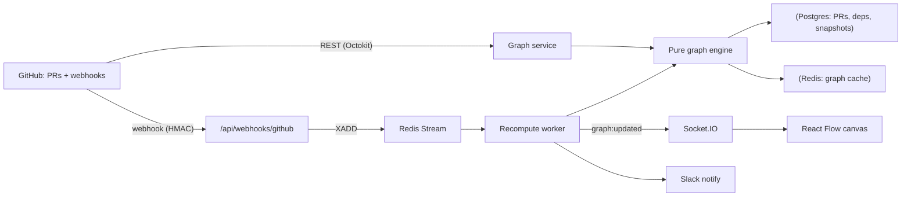

# PRGraph

**See which pull requests are safe to merge — at a glance.**

PRGraph turns a repository's open pull requests into a live, interactive **dependency graph**.
PRs that touch the same files create dependency edges; a deterministic graph engine computes the
**merge order** (topological sort), flags **cycles** (deadlocks), and labels every PR `SAFE`,
`BLOCKED`, or `DEADLOCKED`. GitHub webhooks recompute the graph in real time and push updates over
WebSockets, and Slack gets notified when merging one PR unblocks others.

> Status: MVP (Weeks 1–6) plus the AI semantic-conflict layer (Phase 2), wired into the live
> recompute but **off by default** (`AI_ENABLED=false`) — see [AI (Phase 2)](#ai-phase-2--live-behind-a-flag).

## How it works



The **graph engine** (`src/lib/graph`) is pure and deterministic — no I/O, no clocks, no randomness —
so it is trivially testable and cacheable. Everything else (GitHub, Redis, Postgres, Slack, sockets)
is infrastructure around that core.

## Tech stack

- **Next.js 16** (App Router) + **React 19.2** on **Node.js 24**, TypeScript strict
- **Custom server** (`server/websocket.ts`) hosting the Next handler **and** Socket.IO in one process
- **PostgreSQL 16** via **Prisma 7** (driver adapter) · **Redis 7** (cache, dedupe, Streams queue, pub/sub)
- **React Flow** (`@xyflow/react`) + **dagre** layout · **Tailwind v4** + **shadcn/ui**
- **Octokit** (GitHub App + OAuth) · **Slack** (`@slack/web-api`) · **Prometheus** metrics

## Quickstart (local)

Prerequisites: Node 24, npm, Docker (for Postgres + Redis).

```bash
# 1. Install deps
npm install

# 2. Configure env
cp .env.example .env        # fill in GitHub App / OAuth secrets; generate SESSION_SECRET + ENCRYPTION_KEY

# 3. Start infrastructure
docker compose up -d postgres redis

# 4. Apply the schema
npm run db:generate
npm run db:migrate

# 5. Run the custom server (Next + Socket.IO + webhook worker)
npm run dev
# → http://localhost:3000
```

Generate secrets:

```bash
# SESSION_SECRET (any long random string)
openssl rand -hex 32
# ENCRYPTION_KEY (base64-encoded 32 bytes — used to encrypt stored tokens)
openssl rand -base64 32
```

### GitHub App

Create a GitHub App (Settings → Developer settings → GitHub Apps) with:

- **Permissions:** Pull requests (read), Contents (read), Metadata (read)
- **Webhook URL:** `https://<your-host>/api/webhooks/github`, secret = `GITHUB_WEBHOOK_SECRET`
- **Subscribe to events:** Pull request
- **Callback URL** (OAuth): `https://<your-host>/api/auth/callback`

## Scripts

| Script | Description |
|---|---|
| `npm run dev` | Custom server (Next + Socket.IO + worker) via tsx watch |
| `npm run build` | `next build` (Turbopack) |
| `npm run build:server` | Bundle `server/websocket.ts` → `dist/server.mjs` (esbuild) |
| `npm start` | Run the compiled custom server (`node dist/server.mjs`) |
| `npm test` | Vitest (graph engine suite) |
| `npm run lint` / `typecheck` | ESLint / `tsc --noEmit` |
| `npm run db:migrate` / `db:deploy` | Prisma migrate (dev / prod) |
| `npm run eval` | AI semantic-conflict eval harness — grades the shipping analyzer |
| `npm run eval:baseline` | Write `evals/baseline.json` from the current run |
| `npm run eval:ci` | Eval in CI mode (fail on F1 below threshold or >5pt regression) |

## Docker

```bash
# build + run the full stack (app + postgres + redis)
SESSION_SECRET=... ENCRYPTION_KEY=... docker compose up --build

# with Prometheus
docker compose --profile monitoring up --build
```

The image deliberately does **not** use Next's `output: 'standalone'` — that would drop the Socket.IO
server. Instead it ships `.next` + the esbuild-bundled custom server + a production `node_modules`, and
runs `prisma migrate deploy` before booting (`scripts/start.sh`).

## Project structure

```
server/websocket.ts        Custom Node server: Next + Socket.IO + worker
src/lib/graph/             Pure deterministic engine (build, topo sort, cycles, diff) + service
src/lib/github/            Octokit client, PR/file fetchers, webhook HMAC verify
src/lib/events/            Redis Streams producer + consumer-group worker (DLQ)
src/lib/cache/             Redis singletons + cache-aside helpers
src/lib/slack/             Block Kit builder + notifier
src/lib/ai/                AI semantic-conflict layer (Phase 2, deferred)
src/lib/resilience/        Timeout / retry / circuit breaker
src/components/graph/      React Flow canvas, PR node, legend, detail panel
src/app/                   App Router pages + API route handlers
prisma/schema.prisma       Database schema
.claude/skills/            Engineering rules (wired via AGENTS.md)
```

## AI (Phase 2 — live behind a flag)

`src/lib/ai` is a provider-agnostic LLM adapter (`adapters/`), a versioned prompt registry, a
Zod-validated verdict schema, a content-addressed cache, a daily-budget breaker, and a **heuristic
fallback**. It is wired into the live graph recompute but **off by default** (`AI_ENABLED=false`).

When enabled, after the deterministic engine builds the graph, each overlapping edge is sent to
`analyzeOrFallback` (cache → adapter → Zod → heuristic) with bounded concurrency, using diffs
derived from the PR patches **already fetched** (no extra GitHub calls). `refineGraph` then demotes
`CO_LOCATED` edges to non-blocking and re-runs the topo sort, so AI can only ever soften
`BLOCKED → SAFE` / break a deadlock — never break the graph. Any LLM error/timeout, or hitting the
daily budget, degrades that edge to the deterministic verdict.

How verdicts map to the graph:

- `TRUE_CONFLICT` — edge stays blocking (deterministic severity preserved).
- `CO_LOCATED` — edge demoted to non-blocking; downstream PRs can unblock.
- `UNCERTAIN` — treated conservatively (stays blocking).

### Enabling it

1. Set `OPENAI_API_KEY` (and optionally `LLM_PROVIDER`, `LLM_DAILY_BUDGET_USD`).
2. Validate accuracy on the labeled set:
   ```bash
   AI_ENABLED=true OPENAI_API_KEY=sk-... npm run eval     # expect F1 >= 0.80
   npm run eval:baseline                                  # record the baseline
   ```
3. Flip `AI_ENABLED=true`. CI's secret-gated `eval-ai` job re-checks F1 >= 0.80 (and no >5pt
   regression vs `evals/baseline.json`) on every push; the offline `eval` job always guards the
   heuristic at F1 >= 0.60. Telemetry (`prgraph_llm_*`, `prgraph_ai_*`) feeds the Grafana AI row.

## License

[MIT](LICENSE)
